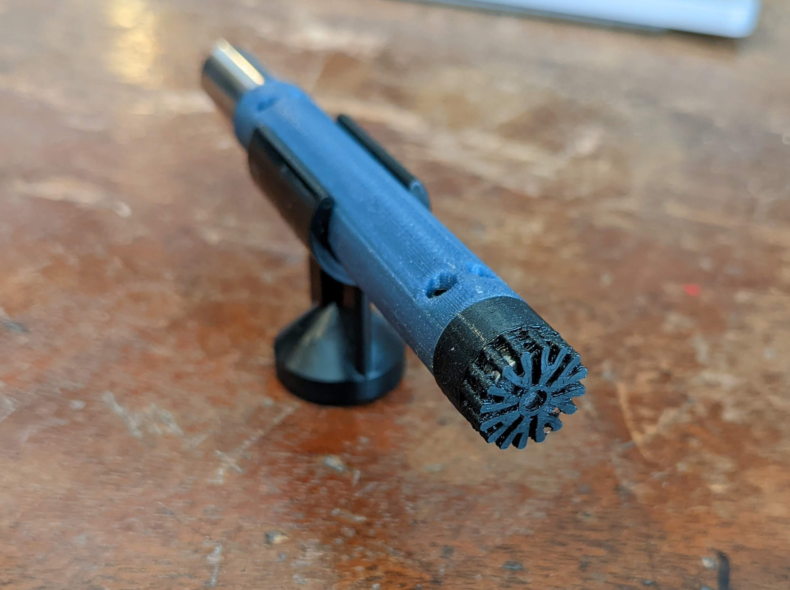
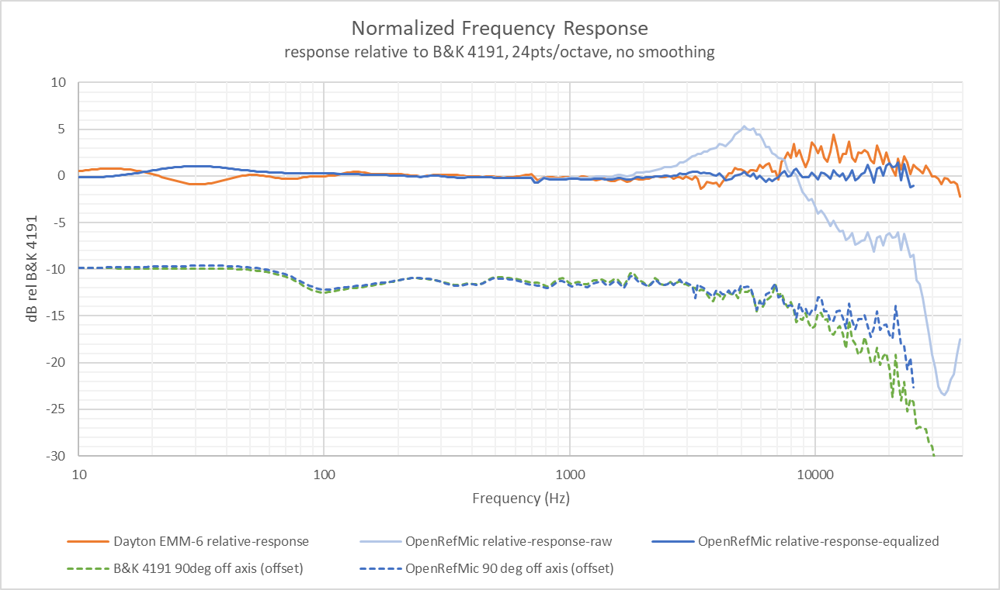
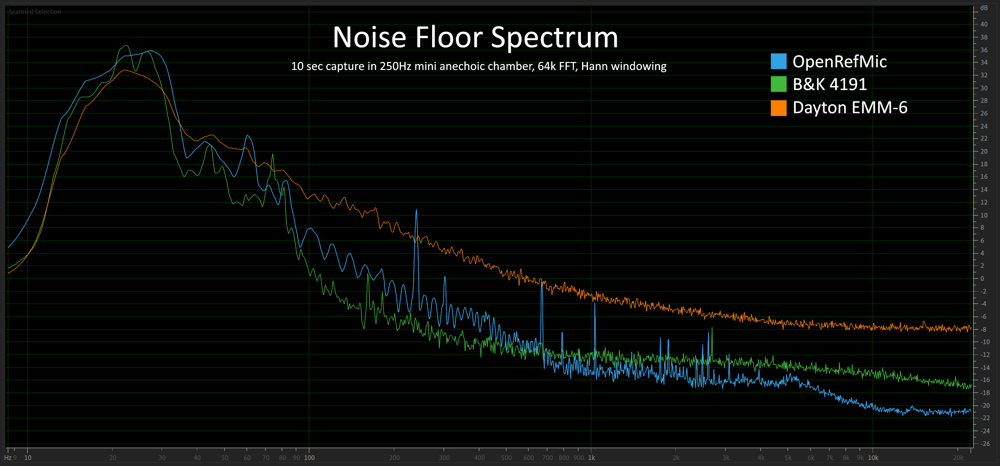

# OpenRefMic
OpenRefMic is an open hardware design for a reference microphone that fits in the popular 1/2" reference microphone form factor, works with consumer microphone interfaces, and meets or exceeds the performance of professional reference microphones at a vastly reduced total system cost.

 
 

## Critical specs, performance

- Frequency Response: 10Hz-25kHz (±1dB after EQ)
- Noise Floor: 18dBA
- Acoustic Overload Point: 118dBSPL
- Dimensions: 12.7x99mm
- Parts cost: $40 (not including 3D printed parts)
- Interface: mini-XLR, 48V phantom power
- Total system cost: <$250 (with Focusrite Scarlett 2i2)

<!--TODO: table with comparison to B&K 4191 and Dayton EMM-6-->

 
 

## Project Overview
The core of the OpenRefMic design is a preamplifier that biases an electret microphone from 48V phantom power and buffers the microphone signal to send it to a standard microphone interface. The circuit was designed for the [PUI AOM-5024L-HD-F-R](https://www.puiaudio.com/media/SpecSheet/AOM-5024L-HD-F-R.pdf) low noise microphone capsule, and has been built and tested with that part, but should work with most other electret mics. The schematic and PCB layout were done with KiCAD and are available in the [Preamplifier section](preamplifier/PREAMPLIFIER.md) of the project, along with the BOM for all electrical and mechanical parts.

 

OpenRefMic construction is simple. The case is 3D printed with any standard material, and the mic capsule is held in place with a press-fit grille printed in TPU. Threads modeled into the case mate with the threads of a mini-XLR connector on the back of the mic body, and everything is held together with 4 small screws. CAD in Fusion360 and STEP formats are in the [Construction section](assembly/CONSTRUCTION.md), along with STLs for the printed parts and a step-by-step construction guide.

 

The performance of the complete OpenRefMic prototype is excellent (after applying equalization). Raw measurement data, compensation curves, and recommendations for applying calibrations to measurements and recordings are in the [Calibration section](calibration/CALIBRATION.md).

 
 

## Project Goals

### Low noise

This is the most important factor of the OpenRefMic project, and all of the other performance metrics and goals are considered "nice to have". While there are several popular affordable measurement microphones on the market (like the Dayton EMM-6), their noise performance ranges from mediocre to poor. Even professional reference microphones tend to prioritize frequency response flatness over noise performance, and very low noise reference microphones are prohibitively expensive for the hobbyist or self-funded experimenter. The video below is an example of the dramatic difference in noise performance between OpenRefMic and the Dayton EMM-6.

[field recording noise comparison](https://user-images.githubusercontent.com/23405416/175431344-0c36cc5d-fb55-48f4-8029-bcf0d835c0a0.mp4)

Low noise is obviously helpful for applications like field recordings or measuring low-level noise emissions, but one area where microphone noise floor is often overlooked is in speaker distortion measurements. Increasing the stimulus and analysis window or moving the microphone closer to the speaker can help resolve lower distortion levels, but those options may not always be feasible for the given speaker or test setup. The graph below is an example of the differences that you might see between distortion measurements with a typical budget measurement mic with a ~34dBA noise floor and an OpenRefMic with ~18dBA noise floor.

 

### Flat, omnidirectional frequency response

A reference microphone should have a frequency response that is flat or characterized well enough that it can be understood how measurements and recordings relate to absolute physical constants. Some aberrations in the off-axis response is expected, particularly at very high frequencies, but the design of the housing, porting, and front grille should minimize directional effects as much as possible. In cases where a flat frequency response is not achievable, the response should be characterized and a process should be defined to apply reciprocal filters to correct recordings.

The microphone element in OpenRefMic has a very low noise floor, but it does not have a flat frequency response. See the calibration page for a compensation curve and filter settings to correct measurements and recordings. 

 

### Compatibility with "prosumer" audio interfaces

Professional reference microphones typically require interfaces that are uncommon outside of labratory settings. IEPE current loops over BNC cables on the more affordable end of the spectrum and 200V polarization supplied via LEMO connectors at the other end, where the cable itself is often over $500. The pro audio world has instead standardized on balanced signals and phantom powering over cheap XLR cables, and OpenRefMic is designed to achieve high performance with these affordable interfaces.

 

### Low cost

Compatibility with consumer-grade microphone interfaces eliminates the prohibitive costs of an IEPE or LEMO interface, but the parts availability and BOM cost of the microphone itself should be comparable to that of measurement microphones that target the DIY speaker building market. The parts needed to build an OpenRefMic are cheap and, with the low prices of desktop 3D printers and PCB fabrication services, many builders will be able to make their own OpenRefMic for less than they would spend on a budget measurement microphone.

 

### 1/2" form factor

Many measurement microphones fit a 1/2" cylindrical form factor, or at least have a long probe end with a 1/2" diameter, which helps maintain omnidirectional frequency response up to several kilohertz. Phantom powering necessitates relatively large capacitors, but the OpenRefMic PCB just barely fits within a 1/2" cross-section. Using a mini-XLR connector, the overall microphone dimensions are 12.7x99mm, almost identical to a reference microphone from B&K or GRAS.

Specialized shapes for specific applications are left up to individual builders, but please share your design if you would like to add additional form factors to the project.

 

### Further goals

- The initial design is based around the PUI AOM-5024L-HD-F-R electret microphone capsule, but designs for additional capsules that trade noise performance for frequency response flatness will be added in the future. The preamplifier as-shown should work with a wide variety of electret mics, and component values can be adjusted for optimal performance. With some minor changes, the preamplifier could support an even wider variety of microphones, including MEMS mics.
- Currently, the prototype OpenRefMic is calibrated against a known reference microphone, a B&K 4191 1/2" Free-Field mic. While the frequency response of another builder's OpenRefMic should be fairly predictable, the absolute sensitivity could vary considerably, depending on component tolerances in the preamp and the voltage sensitivity of their microphone interface. Professional measurement microphones are calibrated in the field with a pistonphone, a device that you insert the microphone tip into, which generates a tone with a precise frequency and sound pressure level that is consistent for a given sealed air volume. If you have any ideas for a device that could replicate this functionality, or otherwise accurately generate or measure a sound pressure level in order to calibrate an OpenRefMic, please reach out.
- Given the very tight margins for fitting the preamplifier PCB into a 1/2" form factor, the initial OpenRefMic design is intended to be 3D printed. The preamplifier is not particularly sensitive to EMI, and unshielded wires connecting the PCB to the electret mic and XLR connector are short, but some electrical noise is present in the noise floor spectrum and a fully shielded housing would be nice for electrically noisy environments.
